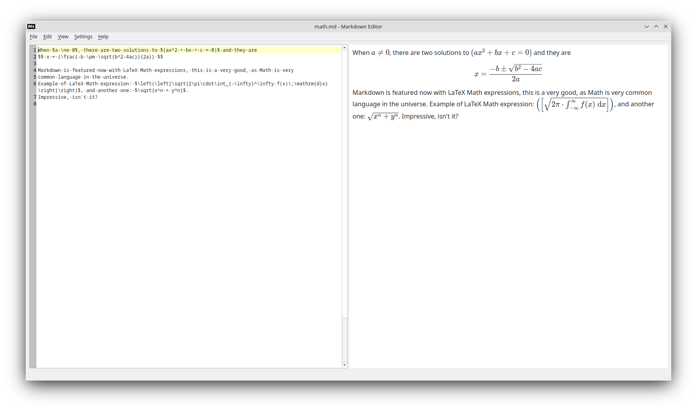

This is a `Markdown` editor for Qt 6.

Almost ready for use, there some minor issues with `QWebEngineView` in Qt 6.4.3,
but you can play with it already.

This application can be used from command line as rendered `HTML` preview.

And one feature - this application can load all linked `Markdown` files from root
document to preview all, for example, `GitHub` `Markdown` pages as one `HTML` book,
this is quite usefull.

And a cherry on the cake - `LaTeX Math` injections are rendered in preview. Look at the screenshots.

One more, guys, you can convert your `Markdown` document into `PDF` from the `File` menu. To activate
this option you need to place `md-pdf-gui` executable in the same folder with `md-editor`
executable. Sources of `md-pdf-gui` you can get [here](https://github.com/igormironchik/md-pdf).

Thanks.

# Installers

You can make `x64` installers for `Linux` and `Windows` by cloning [this](https://github.com/igormironchik/markdown) repository and running `deploy` workflow. Or use latest `deploy`
workflow to download ready artifacts. Note, that `deploy_mac` is not tested ever, it's just an
experiment.

# Building

When you cloned repository don't forget to update submodules!

```
git submodule update --init --recursive
```

Build process is quite easy, just use `QtCreator` to open `CMakeLists.txt` and build in IDE, or use
`CMake` from a shell.

# Screenshots




# Known issues

* Generated TOC may not work on `GitHub` if heading has text separated with two or more spaces.
I will generate label like text is separated with one space, i.e. label will look like: `text-text`,
where `-` replaces space, whereas `GitHub` will do `text--text`, i.e. two `-` for two spaces.
To keep heading's auto labels work just don't use redundant spaces in headings, and TOC will
work both in this editor and on `GitHub`.

* Don't use `HTML` attribute `class` in `HTML` tags, it can lead to wrongly rendered content.
`GitHub` do a magick in this case, it just deletes `class` attribute, but this editor places
`HTML` tags as they present.

* Links hovering may not change cursor shape due to [QTBUG-111927](https://bugreports.qt.io/browse/QTBUG-111927)

* Strange behaviour of font combo box in fonts dialog on check in/out check box to constraint
fonts to monospaced due to [QTBUG-112145](https://bugreports.qt.io/browse/QTBUG-112145)
