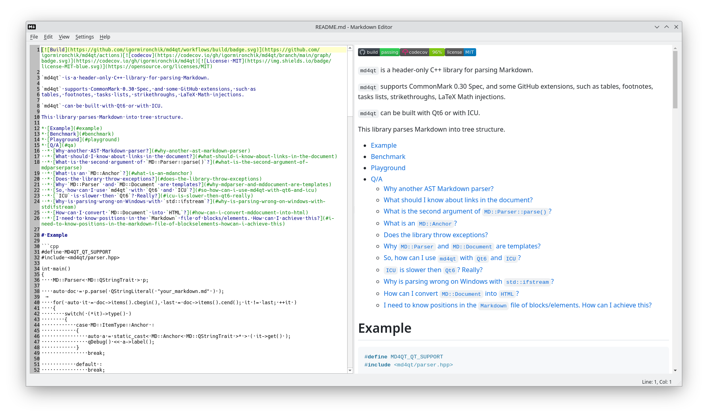
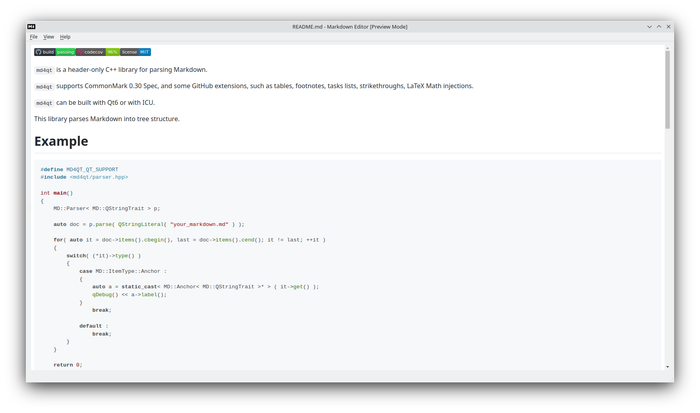

This is a `Markdown` editor for Qt 6.

Almost ready for use, there some minor issues with `QWebEngineView` in Qt 6.4.3,
but you can play with it already.

This application can be used from command line as rendered HTML preview.

And one feature - this application can load all linked Markdown files from root
document to preview all, for example, GitHub Markdown pages as one HTML book,
this is quite usefull.

Thanks.

# Building

When you cloned repository don't forget to update submodules!

Build process is quite easy, just use `QtCreator` to open `CMakeLists.txt` and build in IDE, or use
`CMake` from shell.

# Screenshots

